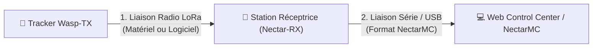

# Guide Complet sur les Niveaux de Contrôle d'Intégrité (CRC) — Wasp-TX

Ce document détaille comment l'intégrité des données de télémétrie est assurée, depuis la fusée/ballon tracker (Wasp-TX) jusqu'à votre écran de contrôle.

Pour éviter toute corruption de données ou l'affichage de paquets mal transmis, **deux niveaux de contrôle d'intégrité** sont mis en place :

---

## Niveau 1 : La Liaison Radio LoRa (Tracker ➔ Station Réceptrice)

Ce contrôle vérifie que le paquet radio capté dans les airs n'a pas été altéré par le bruit de fond électromagnétique ou la distance.

### Option A : Le CRC Matériel (Recommandé & Par défaut)
C'est le mode standard configuré au démarrage.
*   **Fonctionnement** : Le calcul et la validation du CRC16 standard CCITT (polynôme $X^{16} + X^{12} + X^5 + 1$) sont faits directement **en silicium par la puce radio (SX1262/SX1276)**.
*   **Validation** : Si le CRC calculé par la puce de réception ne correspond pas à la signature transmise, le paquet est directement jeté au niveau matériel.
*   **Commande AT associée** : `AT+CRC=1` (Active le CRC).

### Option B : Le CRC Logiciel
Si le CRC matériel est désactivé (`AT+CRC=0`), la station sol attend un CRC16 logiciel calculé par l'émetteur et ajouté à la fin de la charge utile de la trame radio.

---

## Niveau 2 : La Liaison Série & Bluetooth (Station / Tracker ➔ PC)

Lorsque les données de télémétrie sont envoyées vers l'ordinateur de contrôle via USB ou Bluetooth (qu'il s'agisse de la station sol réceptrice ou de Wasp-TX configuré avec `AT+BINUSB=1`), elles sont encapsulées dans le format de trame **NectarMC**.

Pour éviter que des perturbations physiques sur le câble série ou la liaison Bluetooth SPP ne corrompent les données reçues par le PC, la station applique une validation logicielle :

*   **Calcul de validation** : L'émetteur calcule un **CRC16-CCITT** (polynôme `0x1021`, initialisé à `0xFFFF`) sur l'ensemble de la trame binaire (depuis l'octet MAGIC `0xEB` jusqu'au Timestamp inclus).
*   **Validation finale** : Le PC (Web Control Center) lit la signature reçue, recalcule le CRC sur les octets reçus, et s'assure de leur concordance exacte :
    *   **Si concordant** : La trame est traitée et décodée, puis affichée avec le statut `OK` dans le tableau.
    *   **Si discordant** : La ligne de télémétrie s'affiche avec la mention `KO` et n'est pas traitée (les données décodées et la carte ne sont pas mises à jour pour éviter de fausses trajectoires).
