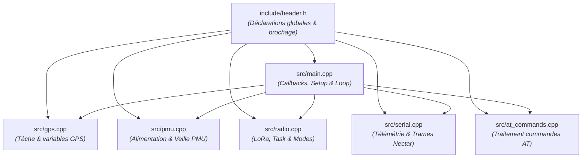
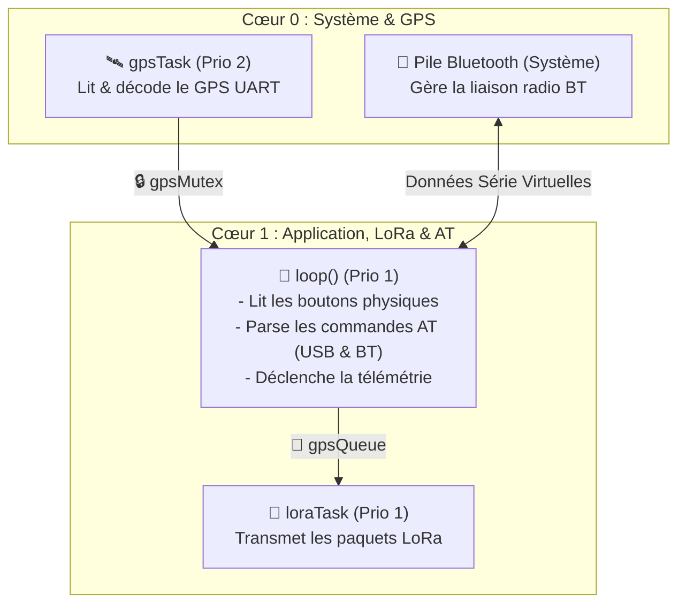

# Wasp-TX : Wireless Altitude & Status Positioning 

**Wasp-TX** est un firmware open-source destiné au suivi télémétrique par radiofréquence (LoRa) et GNSS, conçu pour les applications de **rocketry amateur**. Il permet l'acquisition de données de positionnement et leur transmission vers une station sol.
Ce firmware est développé pour les plateformes [LilyGO TTGO T-Beam](https://lilygo.cc/en-us/products/t-beam-meshtastic?variant=51708927312053)
Wasp-TX est intégré à l'écosystème **NectarMC** pour le traitement et la visualisation des données :

* **Réception (Liaison descendante) :** Compatible avec la station **[Nectar-RX](https://github.com/axpaul/Nectar-RxStation-LoRa32)**, configurée pour la capture des trames LoRa.
* **Traitement et visualisation :** Intégration avec la plateforme **[NectarMC](https://github.com/mlavardin/NectarMC)** pour le suivi en temps réel de la trajectoire et l'analyse post-vol.

---

## Fonctionnalités principales

* **Géolocalisation** : Lecture en temps réel des coordonnées GPS, de l'altitude, de la vitesse, du cap et du temps UTC (U-blox NEO-M8N / NEO-6M).
* **Télémétrie LoRa (Format Nectar)** : Envoi périodique des trames télémétriques compressées et sécurisées par CRC.
* **Interface de configuration AT** :
  * Accessible via la liaison USB Série et via **Bluetooth Classique (SPP)**.
  * Commandes AT riches pour paramétrer la radio, l'identifiant du tracker, le type, la fréquence d'envoi, etc.
  * Sauvegarde automatique et persistante des réglages dans la mémoire flash non volatile (NVS).

---

## Aperçu du Matériel

Voici les vues de la carte de développement ainsi que son brochage (Pinout) et ses dimensions :

<p align="center">
  
  <br>
  <em>Brochage de la carte TTGO T-BEAM</em>
</p>
<p align="center">
  
  <br>
  <em>Format de la carte TTGO T-BEAM</em>
</p>

- **[Télécharger le Schéma PDF de la TTGO TBEAM V1.1](LilyGo_TBeam_V1.1.pdf)**
- **[Télécharger le Schéma PDF de la TTGO TBEAM V1.2](LilyGo_TBeam_V1.2.pdf)**

---

## Configuration Matérielle (LilyGO T-Beam)

Le code s'adapte automatiquement selon l'environnement de compilation choisi :
* **T-Beam v1.1** : Utilise la puce d'alimentation AXP192. Active automatiquement l'alimentation du GPS (LDO3 @ 3.3V) et du module LoRa (LDO2 @ 3.3V), ainsi que l'ADC de mesure de batterie et la détection d'accu.
* **T-Beam v1.2** : Utilise la puce d'alimentation AXP2101. Active l'alimentation du GPS (ALDO3 @ 3.3V) et du LoRa (ALDO2 @ 3.3V).

---

## Gestion de l'Alimentation, Boutons et LEDs

Wasp-TX intègre une gestion logique de l'alimentation, des boutons physiques et des indicateurs lumineux de la carte TTGO T-Beam :

### 🔘 Fonctions des Boutons

*   **Bouton d'Alimentation (PEKEY)** :
    *   **Allumage** : Un appui simple de ~1 seconde démarre proprement la carte.
    *   **Extinction complète (Software Power Off)** : Un clic ou double-clic (selon la version de T-Beam) envoie un signal d'extinction logicielle complète. Le PMU coupe alors l'alimentation électrique de la radio et du GPS, puis ordonne l'extinction matérielle globale (`PMU.shutdown()`).
    *   *Note : Si le câble USB reste branché, la tension VBUS maintient l'alimentation de l'ESP32 ; la carte bascule alors automatiquement en veille profonde (Deep Sleep).*

*   **Bouton Utilisateur (GPIO 38)** :
    *   **Appui Court** : Alterne entre le **Mode Vol 🚀** (performance, fréquence d'envoi nominale, puissance radio max) et le **Mode Éco 🔋** (économie d'énergie, émission ralentie à 15s min, puissance réduite à 10 dBm).
    *   **Appui Long ($\ge 1.5$ seconde)** : Éteint le GPS et la radio et bascule immédiatement l'ESP32 en **veille Standby** (Deep Sleep, consommation < 15 µA).
    *   **Réveil (Wakeup)** : Si la carte est en veille Standby, un simple appui sur ce bouton (GPIO 38) réveille instantanément le tracker.

### 💡 Rôle des LEDs (Rouge vs Bleue)

*   **LED Rouge Utilisateur (GPIO 4)** : C'est la seule LED pilotée par le programme. Elle est active à l'état bas (`LOW`).
    *   **Envoi Télémétrie** : Clignote **1 fois** court à chaque transmission en Mode Vol, et **2 fois** court en Mode Éco.
    *   **Changement de Mode** : Clignote **1 fois long** (400ms) pour confirmer le passage en Mode Vol, et **2 fois long** (350ms) pour le passage en Mode Éco.
    *   **Extinction/Veille** : Clignote rapidement 4 fois pour confirmer l'extinction logicielle, ou 1 fois long (400ms) pour confirmer la mise en veille Standby.
*   **LED Bleue de Charge (CHG)** : Cette LED n'est **pas pilotable logiquement**. Elle est câblée physiquement sur le circuit d'alimentation et s'allume automatiquement en bleu uniquement lorsqu'un accu est en cours de chargement via le port USB. Elle reste éteinte si la batterie est chargée ou absente.

---

## Structure du Code et Architecture

Wasp-TX est conçu de manière modulaire pour séparer les responsabilités et garder le point d'entrée du programme propre et lisible.

### 📁 Organisation des Fichiers


### 📡 Contextes d'Exécution et Multicoeur (FreeRTOS)
Le firmware tire parti de l'architecture **double cœur de l'ESP32** pour séparer les tâches critiques (GPS) des tâches applicatives (Commandes AT, Bluetooth, boucle d'envoi).

*   **Le Cœur 1 (APP_CPU)** exécute la boucle principale `loop()` (qui gère les boutons et parse les commandes AT reçues via USB et Bluetooth) ainsi que l'envoi LoRa.
*   **Le Cœur 0 (PRO_CPU)** gère la pile Bluetooth système et la tâche prioritaire GPS en tâche de fond.



### Rôle et contenu de chaque fichier :
*   **[include/header.h](file:///c:/Users/paulm/OneDrive/Documents/PlatformIO/Projects/Wasp-TX/include/header.h)** : Déclarations globales. Définit le brochage (pinout) des cartes T-Beam v1.1 et v1.2, la structure binaire de la charge utile WASP (32 octets), la structure thread-safe `WaspGPSData`, et exporte les variables d'état partagées (comme le mode actif `currentMode`).
*   **[src/main.cpp](file:///c:/Users/paulm/OneDrive/Documents/PlatformIO/Projects/Wasp-TX/src/main.cpp)** : Séquenceur principal. Contient `setup()`, `loop()`, l'interruption du timer (`onTimer()`), et la boucle de contrôle avec anti-rebond pour le bouton utilisateur. Il se concentre sur l'initialisation matérielle et la gestion logique globale.
*   **[src/gps.cpp](file:///c:/Users/paulm/OneDrive/Documents/PlatformIO/Projects/Wasp-TX/src/gps.cpp)** : Télémétrie GPS. Contient l'instance de `TinyGPSPlus`, les variables et verrous d'échange (`gpsMutex`, `sharedGPSData`), ainsi que la tâche d'arrière-plan autonome `gpsTask()` s'exécutant sur le Cœur 0 pour le décodage NMEA.
*   **[src/pmu.cpp](file:///c:/Users/paulm/OneDrive/Documents/PlatformIO/Projects/Wasp-TX/src/pmu.cpp)** : Gestion d'énergie (PMU AXP192/AXP2101). Initialise le circuit d'alimentation, gère l'extinction logicielle complète (`gracefulShutdown()`) et la veille profonde (`enterStandbyMode()`).
*   **[src/radio.cpp](file:///c:/Users/paulm/OneDrive/Documents/PlatformIO/Projects/Wasp-TX/src/radio.cpp)** : Émission radio. Gère l'initialisation de la radio SX1276, la tâche FreeRTOS `loraTask()` de transmission (avec modulation du clignotement de la LED rouge) et applique la configuration de puissance/débit via `configureMode()`.
*   **[src/serial.cpp](file:///c:/Users/paulm/OneDrive/Documents/PlatformIO/Projects/Wasp-TX/src/serial.cpp)** : Communication série et télémétrie. Assemble de manière thread-safe le paquet WASP (avec encodage du mode actif sur le bit 5 du statut) et émet la trame NectarMC cryptée/CRC sur USB et Bluetooth.
*   **[src/at_commands.cpp](file:///c:/Users/paulm/OneDrive/Documents/PlatformIO/Projects/Wasp-TX/src/at_commands.cpp)** : Interpréteur de commandes. Parse et exécute les commandes AT de configuration dynamique reçues sur l'USB ou le Bluetooth.

## Installation et Programmation du Firmware

Deux méthodes s'offrent à vous pour programmer votre carte TTGO T-Beam : utiliser les fichiers binaires précompilés (rapide), ou compiler le code source à l'aide de PlatformIO.

### Méthode 1 : Utilisation des Binaires Précompilés (Recommandé)

Si vous ne souhaitez pas compiler le projet, des fichiers `.bin` déjà compilés pour chaque variante matérielle sont disponibles dans le dossier **[binary/](./binary)**.

| Binaire à Flasher | Modèle de T-Beam | Fréquence LoRa | Puce PMU |
| :--- | :--- | :--- | :--- |
| **[Wasp-TX_v1.1_868MHz.bin](./binary/Wasp-TX_v1.1_868MHz.bin)** | T-Beam v1.1 | **868 MHz** | AXP192 |
| **[Wasp-TX_v1.2_868MHz.bin](./binary/Wasp-TX_v1.2_868MHz.bin)** | T-Beam v1.2 | **868 MHz** | AXP2101 |
| **[Wasp-TX_v1.1_433MHz.bin](./binary/Wasp-TX_v1.1_433MHz.bin)** | T-Beam v1.1 | **433 MHz** | AXP192 |
| **[Wasp-TX_v1.2_433MHz.bin](./binary/Wasp-TX_v1.2_433MHz.bin)** | T-Beam v1.2 | **433 MHz** | AXP2101 |

**Procédure de flash rapide :**
1. Connectez votre T-Beam en USB à votre ordinateur.
2. Ouvrez l'outil de flash en ligne **[ESP Web Flasher](https://esp.github.io/esptool-js/)** ou utilisez l'outil local **Esptool** en ligne de commande :
   ```bash
   esptool.py --chip esp32 --port COM_PORT write_flash 0x10000 binary/Wasp-TX_v1.X_XXXMHz.bin
   ```
   *(Remplacez `COM_PORT` par le port de votre carte et spécifiez le bon fichier `.bin`)*.

---

### Méthode 2 : Compilation et Téléversement depuis les Sources (PlatformIO)

Si vous souhaitez modifier le code ou compiler vous-même le projet, vous devez utiliser **PlatformIO** (intégré à VS Code).

1. Ouvrez le dossier du projet `Wasp-TX` dans VS Code.
2. PlatformIO va charger le fichier de configuration `platformio.ini` et installer automatiquement les bibliothèques requises.
3. Utilisez les boutons de la barre d'état de PlatformIO ou lancez l'une des commandes suivantes dans le terminal intégré pour compiler et envoyer le programme :

#### 🛰️ Pour les versions 868 MHz (Standard)
*   **Pour T-Beam v1.1 (AXP192)** :
    ```bash
    pio run -e tbeam_v1_1 -t upload -t monitor
    ```
*   **Pour T-Beam v1.2 (AXP2101)** :
    ```bash
    pio run -e tbeam_v1_2 -t upload -t monitor
    ```

#### 🛰️ Pour les versions 433 MHz
*   **Pour T-Beam v1.1 (AXP192)** :
    ```bash
    pio run -e tbeam_v1_1_433 -t upload -t monitor
    ```
*   **Pour T-Beam v1.2 (AXP2101)** :
    ```bash
    pio run -e tbeam_v1_2_433 -t upload -t monitor
    ```

---

## Commandes AT Disponibles

Les commandes AT peuvent être envoyées via USB Série (`115200` bauds) ou via le Bluetooth (nom Bluetooth par défaut : `Wasp-TX-<ID>`). Elles se terminent par un retour à la ligne `\r\n`.

| Commande | Action | Exemple de réponse / Comportement |
| --- | --- | --- |
| `AT` | Test de communication | `OK` |
| `AT+HELP` ou `AT?` | Affiche l'aide et les commandes | *(Liste des commandes)* |
| `AT+VER` ou `AT+INFO` | Affiche la version du firmware | `+INFO: WASP-TX TRACKER,FW=1.0.0` |
| `AT+CFG` ou `AT+STATUS` | Affiche la configuration détaillée | *(Tableau de configuration)* |
| `AT+ID=<0-255>` | Règle l'identifiant du tracker (SSID Num) | `OK` |
| `AT+ID?` | Récupère l'identifiant du tracker | `+ID: 1` |
| `AT+TYPE=<0-3>` | Règle le type (0=FX, 1=MF, 2=BALLOON, 3=OTHER) | `OK` |
| `AT+TYPE?` | Récupère le type de tracker | `+TYPE: 2` |
| `AT+INTERVAL=<sec>` | Règle l'intervalle d'envoi en secondes (1-3600) | `OK` *(Sauvegarde automatique)* |
| `AT+INTERVAL?` | Récupère l'intervalle d'envoi | `+INTERVAL: 1` |
| `AT+FREQ=<mhz>` | Règle la fréquence active (ex: `868.500`) | `OK` |
| `AT+FREQ?` | Récupère la fréquence active | `+FREQ: 868.000` |
| `AT+SF=<6-12>` | Règle le Spreading Factor LoRa | `OK` |
| `AT+SF?` | Récupère le Spreading Factor LoRa | `+SF: 9` |
| `AT+BW=<khz>` | Règle la bande passante LoRa | `OK` |
| `AT+BW?` | Récupère la bande passante LoRa | `+BW: 125.0` |
| `AT+POWER=<dbm>` | Règle la puissance d'émission LoRa (2-20) | `OK` |
| `AT+POWER?` | Récupère la puissance d'émission LoRa | `+POWER: 14` |
| `AT+CRC=<0\|1>` | Active (1) ou désactive (0) le CRC LoRa | `OK` |
| `AT+CRC?` | Récupère le statut du CRC | `+CRC: 1,0` (CRC On, Mode CCITT) |
| `AT+DEBUG=<0\|1>` | Active (1) ou désactive (0) les logs texte `[TX]` / `[HEX]` | `OK` *(Sauvegarde automatique)* |
| `AT+DEBUG?` | Récupère le statut des logs texte | `+DEBUG: 0` |
| `AT+BINUSB=<0\|1>` | Active (1) ou désactive (0) la trame binaire brute USB | `OK` *(Sauvegarde automatique)* |
| `AT+BINUSB?` | Récupère le statut de la trame brute USB | `+BINUSB: 0` |
| `AT+SAVE` | Sauvegarde manuellement les réglages en NVS | `OK` |
| `AT+RESET` | Réinitialise les réglages d'usine et redémarre | `OK` |

---

## Tests Unitaires (Framework Unity)

Le firmware inclut une suite de tests unitaires écrits avec le framework **Unity** de PlatformIO. Ces tests permettent de vérifier la cohérence des structures de données, la validité des constantes par défaut et le calcul du CRC16.

Pour compiler et exécuter les tests unitaires directement sur votre carte TTGO T-Beam connectée :

```bash
# Pour tester la version T-Beam v1.1 (AXP192)
pio test -e tbeam_v1_1

# Pour tester la version T-Beam v1.2 (AXP2101)
pio test -e tbeam_v1_2
```

---

## 📡 Documentation des Trames et Commandes (Protocole NectarMC)

Pour en savoir plus sur les spécifications de communication, le contrôle d'intégrité et la syntaxe des commandes :
* 👉 **[Guide Complet des Commandes AT](./AT_GUIDE.md)** : Liste complète, formats et paramètres des commandes de configuration de la carte.
* 👉 **[Guide de Contrôle d'Intégrité (CRC)](./CRC_GUIDE.md)** : Description des deux niveaux de CRC (Radio LoRa et Liaison Série USB/Bluetooth).
* 👉 **[Guide des Formats de Trames](./FRAME_GUIDE.md)** : Structure des paquets LoRa (Air), des trames série NectarMC, et de la charge utile WASP optimisée de 32 octets.
