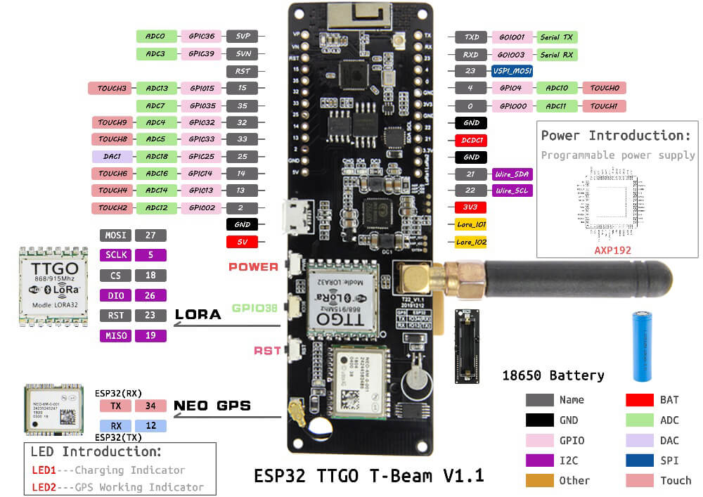
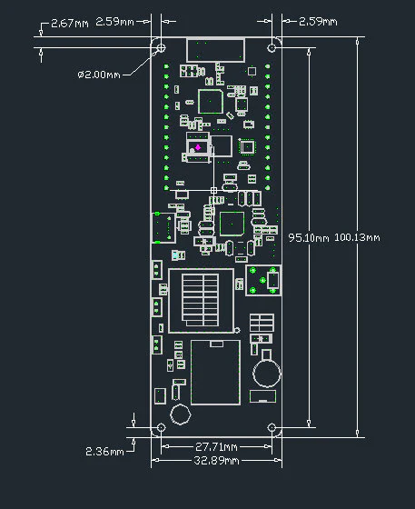
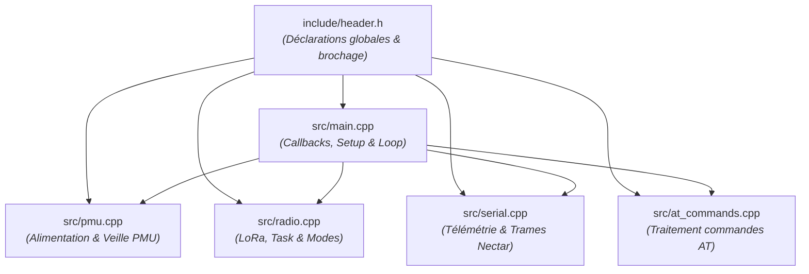
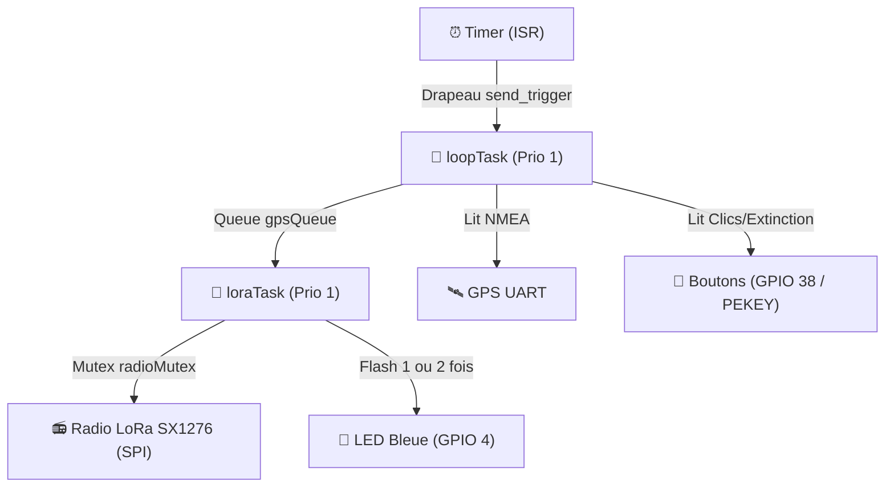

# Wasp-TX : Wireless Altitude & Status Positioning 

**Wasp-TX** est un firmware open-source destiné au suivi télémétrique par radiofréquence (LoRa) et GNSS, conçu pour les applications de **rocketry amateur**. Il permet l'acquisition de données de positionnement et leur transmission vers une station sol.
Ce firmware est développé pour les plateformes [LilyGO TTGO T-Beam](https://lilygo.cc/en-us/products/t-beam-meshtastic?variant=51708927312053)
Wasp-TX est intégré à l'écosystème **NectarMC** pour le traitement et la visualisation des données :

* **Réception (Liaison descendante) :** Compatible avec la station **[Nectar-RX](https://github.com/axpaul/Nectar-RxStation-LoRa32)**, configurée pour la capture des trames LoRa.
* **Traitement et visualisation :** Intégration avec la plateforme **[NectarMC](https://github.com/mlavardin/NectarMC)** pour le suivi en temps réel de la trajectoire et l'analyse post-vol.

---

## Fonctionnalités principales

* **Géolocalisation** : Lecture en temps réel des coordonnées GPS, de l'altitude, de la vitesse, du cap et du temps UTC (U-blox NEO-M8N / NEO-6M).
* **Télémétrie LoRa (Format Nectar)** : Envoi périodique des trames télémétriques compressées et sécurisées par CRC.
* **Interface de configuration AT** :
  * Accessible via la liaison USB Série et via **Bluetooth Classique (SPP)**.
  * Commandes AT riches pour paramétrer la radio, l'identifiant du tracker, le type, la fréquence d'envoi, etc.
  * Sauvegarde automatique et persistante des réglages dans la mémoire flash non volatile (NVS).

---

## Aperçu du Matériel

Voici les vues de la carte de développement ainsi que son brochage (Pinout) et ses dimensions :

<p align="center">
  
  <br>
  <em>Brochage de la carte TTGO T-BEAM</em>
</p>
<p align="center">
  
  <br>
  <em>Format de la carte TTGO T-BEAM</em>
</p>

- **[Télécharger le Schéma PDF de la TTGO TBEAM V1.1](LilyGo_TBeam_V1.1.pdf)**
- **[Télécharger le Schéma PDF de la TTGO TBEAM V1.2](LilyGo_TBeam_V1.2.pdf)**

---

## Configuration Matérielle (LilyGO T-Beam)

Le code s'adapte automatiquement selon l'environnement de compilation choisi :
* **T-Beam v1.1** : Utilise la puce d'alimentation AXP192. Active automatiquement l'alimentation du GPS (LDO3 @ 3.3V) et du module LoRa (LDO2 @ 3.3V), ainsi que l'ADC de mesure de batterie et la détection d'accu.
* **T-Beam v1.2** : Utilise la puce d'alimentation AXP2101. Active l'alimentation du GPS (ALDO3 @ 3.3V) et du LoRa (ALDO2 @ 3.3V).

---

## Gestion de l'Alimentation et Boutons (On / Off / Sleep)

Wasp-TX intègre une gestion logique de l'alimentation de la carte TTGO T-Beam pour préserver la batterie et sécuriser son fonctionnement :

* **Bouton d'Alimentation (PEKEY)** :
  * **Allumage** : Un appui simple de ~1 seconde allume la carte et lance le tracker.
  * **Extinction Propre (Software Power Off)** : Un clic ou un double-clic sur le bouton d'alimentation déclenche une séquence d'extinction logicielle complète :
    1. Mise en sommeil de la puce radio LoRa (`radio.sleep()`) pour stopper toute consommation.
    2. Extinction électrique complète du module GPS (LDO3 / ALDO3) et de la radio LoRa (LDO2 / ALDO2) par le PMU.
    3. Signal de confirmation visuel (clignotement rapide 4 fois de la LED de la carte sur GPIO 4).
    4. Extinction matérielle complète commandée au PMU (`PMU.shutdown()`).
    * *Note : Si le câble USB reste branché, la tension VBUS maintient l'alimentation ; l'ESP32 bascule alors automatiquement en veille Deep Sleep.*

* **Bouton Utilisateur (GPIO 38)** :
  * **Mise en Standby (Mise en Veille)** : Un appui simple sur le bouton utilisateur éteint la radio/GPS et bascule immédiatement l'ESP32 en Deep Sleep (consommation < 15 µA).
  * **Réveil (Wakeup)** : Un nouvel appui sur ce bouton utilisateur (GPIO 38) réveille instantanément la carte.

---

## Structure du Code et Architecture

Wasp-TX est conçu de manière modulaire pour séparer les responsabilités et garder le point d'entrée du programme propre et lisible.

### 📁 Organisation des Fichiers


### 📡 Contextes d'Exécution et Priorités (FreeRTOS)
Le firmware s'exécute de façon asynchrone sur l'ESP32 en combinant des interruptions matérielles (ISR), la boucle principale, et une tâche d'émission LoRa asynchrone.



### Rôle et contenu de chaque fichier :
*   **[include/header.h](file:///c:/Users/paulm/OneDrive/Documents/PlatformIO/Projects/Wasp-TX/include/header.h)** : Déclarations globales. Définit le brochage (pinout) des cartes T-Beam v1.1 et v1.2, la structure binaire de la charge utile WASP (32 octets), et exporte les variables d'état partagées (comme le mode actif `currentMode`).
*   **[src/main.cpp](file:///c:/Users/paulm/OneDrive/Documents/PlatformIO/Projects/Wasp-TX/src/main.cpp)** : Séquenceur principal. Contient uniquement `setup()`, `loop()`, l'interruption du timer (`onTimer()`), et la boucle de contrôle avec anti-rebond pour le bouton utilisateur.
*   **[src/pmu.cpp](file:///c:/Users/paulm/OneDrive/Documents/PlatformIO/Projects/Wasp-TX/src/pmu.cpp)** : Gestion d'énergie (PMU AXP192/AXP2101). Initialise le circuit d'alimentation, gère l'extinction logicielle complète (`gracefulShutdown()`) et la veille profonde (`enterStandbyMode()`).
*   **[src/radio.cpp](file:///c:/Users/paulm/OneDrive/Documents/PlatformIO/Projects/Wasp-TX/src/radio.cpp)** : Émission radio. Gère l'initialisation de la radio SX1276, la tâche FreeRTOS `loraTask()` de transmission (avec modulation du clignotement de la LED bleue) et applique la configuration de puissance/débit via `configureMode()`.
*   **[src/serial.cpp](file:///c:/Users/paulm/OneDrive/Documents/PlatformIO/Projects/Wasp-TX/src/serial.cpp)** : Communication série et télémétrie. Assemble le paquet WASP (avec encodage du mode actif sur le bit 5 du statut) et émet la trame NectarMC cryptée/CRC sur USB et Bluetooth.
*   **[src/at_commands.cpp](file:///c:/Users/paulm/OneDrive/Documents/PlatformIO/Projects/Wasp-TX/src/at_commands.cpp)** : Interpréteur de commandes. Parse et exécute les commandes AT de configuration dynamique reçues sur l'USB ou le Bluetooth.

---

## External Libraries

Les dépendances du projet sont gérées via `platformio.ini`. Les bibliothèques suivantes sont requises pour le fonctionnement du firmware :

| Library | Version | Purpose |
| :--- | :--- | :--- |
| **RadioLib** | `^6.0.0` | Gestion de la communication radio LoRa |
| **ESP32Time** | `^2.0.0` | Gestion de l'horloge interne (RTC) |
| **XPowersLib** | `^0.2.6` | Gestion de l'alimentation (PMU AXP192/AXP2101) |
| **TinyGPSPlus** | `^1.0.3` | Décodage des trames de données GPS |

---

## Compilation et Téléversement (PlatformIO)

Ouvrez le projet dans VS Code avec l'extension PlatformIO, puis sélectionnez l'environnement approprié :

### 1. Pour la T-Beam v1.1 (AXP192)
```bash
# Compilation
pio run -e tbeam_v1_1

# Téléversement et moniteur série
pio run -e tbeam_v1_1 -t upload -t monitor
```

### 2. Pour la T-Beam v1.2 (AXP2101)
```bash
# Compilation
pio run -e tbeam_v1_2

# Téléversement et moniteur série
pio run -e tbeam_v1_2 -t upload -t monitor
```

---

## Commandes AT Disponibles

Les commandes AT peuvent être envoyées via USB Série (`115200` bauds) ou via le Bluetooth (nom Bluetooth par défaut : `Wasp-TX-<ID>`). Elles se terminent par un retour à la ligne `\r\n`.

| Commande | Action | Exemple de réponse / Comportement |
| --- | --- | --- |
| `AT` | Test de communication | `OK` |
| `AT+HELP` ou `AT?` | Affiche l'aide et les commandes | *(Liste des commandes)* |
| `AT+VER` ou `AT+INFO` | Affiche la version du firmware | `+INFO: WASP-TX TRACKER,FW=1.0.0` |
| `AT+CFG` ou `AT+STATUS` | Affiche la configuration détaillée | *(Tableau de configuration)* |
| `AT+ID=<0-255>` | Règle l'identifiant du tracker (SSID Num) | `OK` |
| `AT+ID?` | Récupère l'identifiant du tracker | `+ID: 1` |
| `AT+TYPE=<0-3>` | Règle le type (0=FX, 1=MF, 2=BALLOON, 3=OTHER) | `OK` |
| `AT+TYPE?` | Récupère le type de tracker | `+TYPE: 2` |
| `AT+INTERVAL=<sec>` | Règle l'intervalle d'envoi en secondes (1-3600) | `OK` *(Sauvegarde automatique)* |
| `AT+INTERVAL?` | Récupère l'intervalle d'envoi | `+INTERVAL: 1` |
| `AT+FREQ=<mhz>` | Règle la fréquence active (ex: `868.500`) | `OK` |
| `AT+FREQ?` | Récupère la fréquence active | `+FREQ: 868.000` |
| `AT+SF=<6-12>` | Règle le Spreading Factor LoRa | `OK` |
| `AT+SF?` | Récupère le Spreading Factor LoRa | `+SF: 9` |
| `AT+BW=<khz>` | Règle la bande passante LoRa | `OK` |
| `AT+BW?` | Récupère la bande passante LoRa | `+BW: 125.0` |
| `AT+POWER=<dbm>` | Règle la puissance d'émission LoRa (2-20) | `OK` |
| `AT+POWER?` | Récupère la puissance d'émission LoRa | `+POWER: 14` |
| `AT+CRC=<0\|1>` | Active (1) ou désactive (0) le CRC LoRa | `OK` |
| `AT+CRC?` | Récupère le statut du CRC | `+CRC: 1,0` (CRC On, Mode CCITT) |
| `AT+DEBUG=<0\|1>` | Active (1) ou désactive (0) les logs texte `[TX]` / `[HEX]` | `OK` *(Sauvegarde automatique)* |
| `AT+DEBUG?` | Récupère le statut des logs texte | `+DEBUG: 0` |
| `AT+BINUSB=<0\|1>` | Active (1) ou désactive (0) la trame binaire brute USB | `OK` *(Sauvegarde automatique)* |
| `AT+BINUSB?` | Récupère le statut de la trame brute USB | `+BINUSB: 0` |
| `AT+SAVE` | Sauvegarde manuellement les réglages en NVS | `OK` |
| `AT+RESET` | Réinitialise les réglages d'usine et redémarre | `OK` |

---

## Tests Unitaires (Framework Unity)

Le firmware inclut une suite de tests unitaires écrits avec le framework **Unity** de PlatformIO. Ces tests permettent de vérifier la cohérence des structures de données, la validité des constantes par défaut et le calcul du CRC16.

Pour compiler et exécuter les tests unitaires directement sur votre carte TTGO T-Beam connectée :

```bash
# Pour tester la version T-Beam v1.1 (AXP192)
pio test -e tbeam_v1_1

# Pour tester la version T-Beam v1.2 (AXP2101)
pio test -e tbeam_v1_2
```

---

## 📡 Documentation des Trames et Commandes (Protocole NectarMC)

Pour en savoir plus sur les spécifications de communication, le contrôle d'intégrité et la syntaxe des commandes :
* 👉 **[Guide Complet des Commandes AT](./AT_GUIDE.md)** : Liste complète, formats et paramètres des commandes de configuration de la carte.
* 👉 **[Guide de Contrôle d'Intégrité (CRC)](./CRC_GUIDE.md)** : Description des deux niveaux de CRC (Radio LoRa et Liaison Série USB/Bluetooth).
* 👉 **[Guide des Formats de Trames](./FRAME_GUIDE.md)** : Structure des paquets LoRa (Air), des trames série NectarMC, et de la charge utile WASP optimisée de 32 octets.
